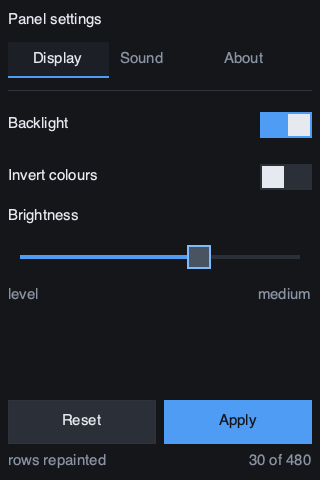

imui-demo
=========

A settings panel for [**imui**](https://github.com/sysl-lang/imui), 320×480 — the size of the real
screen. [**cairo**](https://github.com/sysl-lang/cairo) draws it and
[**sdl3**](https://github.com/sysl-lang/sdl3) shows it.



```
brew install cairo sdl3
sysl run . --link-path /opt/homebrew/lib
```

| input | what it does |
|---|---|
| the mouse | press, drag and release, exactly as a finger on the panel |
| `tab` / `↓` / `↑` | move the focus, as a D-pad would |
| `enter` / `space` | press the focused control |
| `esc` / `Q` | quit |

The window is the panel on the bench — an ST7796 over SPI on a Pico 2 W — and nothing in the program
knows that. `imui` draws through a `Painter`; this supplies one made of cairo, and the board supplies
one made of a framebuffer.

One frame function, two painters
--------------------------------

`frame` is generic over the painter, and that is the load-bearing line in the program. The same body
runs through the `Recorder` — which is where the frame is written down *and* where the widgets find
out what the finger did — and the commands are then replayed through cairo. Nothing is written twice.

```sysl
frame[P: Painter](u: *Ui, p: *P, th: Theme, app: *App)
```

The whole backend is one struct and six members. That is what the seam costs.

What gets repainted is the point
--------------------------------

Every frame is recorded, compared with the last one, and only the horizontal bands that differ are
drawn for real. `--shot` runs three scripted frames through that whole path rather than drawing
straight through cairo, because drawing straight through would check that the widgets work and not
that the thing this library is for works:

```
sysl run . -- --shot
```

```
frame 0: 36 commands, 480 of 480 rows repainted
frame 1: 36 commands,  30 of 480 rows repainted
frame 2: 36 commands,  60 of 480 rows repainted
```

The first frame has nothing behind it. The second repaints **one band** — the readout line, which is
the only thing that changed. The third repaints two: the slider that moved, and the readout. On a
desktop that saves some rasterizing; over SPI it is the difference between 300 KB a frame and a
couple of KB.

The last frame is written to `demo.png`, so a change that breaks the drawing is caught by looking at
a file rather than at a screen.

Why the text goes to cairo's externs
------------------------------------

`CairoPainter.draw_text` calls `externs.show_text` with a NUL-terminated copy in a buffer it owns,
rather than the binding's `Context.show_text`. That is not an optimization.

`imui` declares `@no_alloc`, and the binding's method converts the string with `sysl.text.cstring`,
which makes heap storage. Instantiating an allocator-free library's generics with a painter that
reaches an allocator is refused — the compiler is right, and the nine-line `terminate` here is what
lets a backend built on a C library be used by one anyway. Worth reading if you write a backend of
your own against any C drawing library.

License
-------

[ISC](LICENSE)
